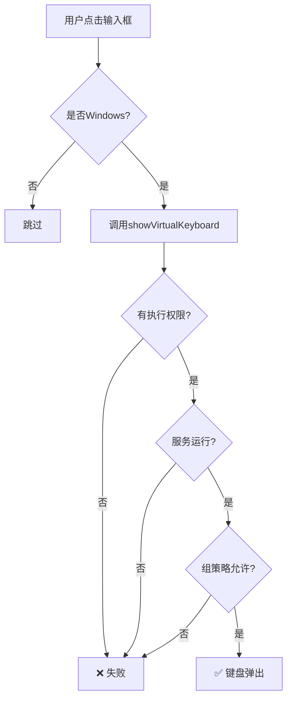

# 🔧 Kiosk账户虚拟键盘问题 - 完整解决方案

## 📋 问题描述

**现象：**
- ✅ Admin账户下：虚拟键盘可以正常弹出
- ❌ Kiosk账户下：虚拟键盘无法弹出

**根本原因：**
Windows系统对不同账户有不同的权限级别，Kiosk账户（受限用户）无法执行某些系统程序（如 `TabTip.exe`），导致虚拟键盘调用失败。

---

## 🎯 解决方案（按推荐顺序）

### 方案1：运行Windows诊断与修复脚本 ⭐⭐⭐⭐⭐

**最简单、最有效的方法**

#### 步骤：

1. **在Admin账户下运行修复脚本：**
   ```powershell
   # 右键点击 -> "以管理员身份运行"
   scripts/fix-keyboard-kiosk.ps1
   ```

2. **脚本会自动完成：**
   - ✅ 检查并启动 `TabletInputService` 服务
   - ✅ 设置服务为自动启动
   - ✅ 检查 `TabTip.exe` 文件权限
   - ✅ 修复注册表配置
   - ✅ 为Kiosk账户授权
   - ✅ 测试虚拟键盘启动
   - ✅ 生成诊断报告

3. **输入Kiosk账户名：**
   - 脚本会提示输入Kiosk账户名称（例如：`kiosk`）
   - 脚本会自动为该账户配置权限

4. **切换到Kiosk账户测试：**
   - 重新登录Kiosk账户
   - 运行应用，测试输入框是否能弹出键盘

#### 预期结果：
- 🎉 服务已启动并设置为自动启动
- 🎉 Kiosk账户已获得TabTip.exe执行权限
- 🎉 虚拟键盘可以正常弹出

---

### 方案2：配置应用以管理员权限运行 ⭐⭐⭐⭐

**更根本的方法，让应用在所有账户下都有足够权限**

#### 已完成的修改：

已在 `package.json` 中添加配置：
```json
{
  "build": {
    "win": {
      "requestedExecutionLevel": "requireAdministrator"
    }
  }
}
```

#### 步骤：

1. **重新打包应用：**
   ```bash
   yarn electron:build:win:macos:skip-check
   ```

2. **安装并测试：**
   - 安装新打包的应用
   - 首次运行时会弹出UAC提示（用户账户控制）
   - 选择"是"以管理员权限运行
   - 应用将拥有完整的系统权限

#### 优点：
- ✅ 一次配置，所有账户都能使用
- ✅ 应用拥有完整的系统权限
- ✅ 无需额外的手动配置

#### 缺点：
- ⚠️ 每次启动都需要UAC确认（可以通过组策略禁用）
- ⚠️ 安全性稍低（应用拥有更高权限）

---

### 方案3：手动配置Windows设置 ⭐⭐⭐

**如果脚本无法运行，可以手动配置**

#### 步骤1：启动触摸键盘服务

1. 按 `Win + R`，输入 `services.msc`
2. 找到以下服务：
   - `TabletInputService`
   - `TouchKeyboardService` (Win11)
3. 右键 -> "属性"
4. 启动类型：`自动`
5. 点击"启动"按钮
6. 点击"应用"和"确定"

#### 步骤2：配置Kiosk账户权限

1. 找到 `TabTip.exe` 文件：
   ```
   C:\Program Files\Common Files\microsoft shared\ink\TabTip.exe
   ```
2. 右键 -> "属性" -> "安全"
3. 点击"编辑"
4. 点击"添加"
5. 输入Kiosk账户名（例如：`kiosk`）
6. 勾选"读取和执行"权限
7. 点击"应用"和"确定"

#### 步骤3：启用触摸键盘自动调用

1. 按 `Win + R`，输入 `regedit`
2. 导航到：
   ```
   HKEY_LOCAL_MACHINE\SOFTWARE\Microsoft\TabletTip\1.7
   ```
3. 创建DWORD值：`EnableDesktopModeAutoInvoke`
4. 设置值为：`1`

---

### 方案4：使用组策略配置 ⭐⭐⭐

**适用于企业或批量部署**

#### 步骤：

1. 按 `Win + R`，输入 `gpedit.msc`
2. 导航到：
   ```
   计算机配置 -> Windows 设置 -> 安全设置 -> 本地策略 -> 安全选项
   ```
3. 找到：`用户账户控制: 以管理员批准模式运行所有管理员`
4. 设置为：`已启用`
5. 重启计算机

---

### 方案5：创建Windows计划任务 ⭐⭐

**让应用在Kiosk账户下自动以管理员权限运行**

#### 步骤：

1. 按 `Win + R`，输入 `taskschd.msc`
2. 右侧点击"创建任务"
3. "常规"选项卡：
   - 名称：`DreamBook Startup`
   - 勾选"使用最高权限运行"
   - 配置为：`Windows 10`
4. "触发器"选项卡：
   - 新建 -> "登录时"
   - 特定用户：选择Kiosk账户
5. "操作"选项卡：
   - 新建 -> "启动程序"
   - 程序：`C:\Program Files\梦境解析\梦境解析.exe`
6. "条件"选项卡：
   - 取消勾选所有电源相关选项
7. "设置"选项卡：
   - 勾选"允许按需运行任务"
8. 点击"确定"

---

## 🧪 测试步骤

### 方法1：在Kiosk账户下测试

1. 切换到Kiosk账户
2. 运行应用
3. 点击输入框
4. 观察是否弹出虚拟键盘

### 方法2：查看日志

应用会自动生成日志文件：
```
C:\Users\<用户名>\dreambook-logs\app-<日期>.log
```

在日志中搜索：
```
[虚拟键盘]
```

查看是否有错误信息。

### 方法3：查看Windows事件查看器

1. 按 `Win + R`，输入 `eventvwr.msc`
2. 导航到：`Windows 日志 -> 应用程序`
3. 查找与 `TabTip` 或 `Electron` 相关的错误

---

## 📊 各方案对比

| 方案 | 难度 | 效果 | 推荐度 | 说明 |
|------|------|------|--------|------|
| 方案1：运行修复脚本 | ⭐ | ⭐⭐⭐⭐⭐ | ⭐⭐⭐⭐⭐ | 自动化，一键修复 |
| 方案2：管理员权限运行 | ⭐⭐ | ⭐⭐⭐⭐⭐ | ⭐⭐⭐⭐ | 永久解决，但需要UAC确认 |
| 方案3：手动配置 | ⭐⭐⭐ | ⭐⭐⭐⭐ | ⭐⭐⭐ | 适合脚本失败时 |
| 方案4：组策略 | ⭐⭐⭐⭐ | ⭐⭐⭐⭐ | ⭐⭐ | 适合企业环境 |
| 方案5：计划任务 | ⭐⭐⭐ | ⭐⭐⭐⭐ | ⭐⭐⭐ | 适合Kiosk模式自动启动 |

---

## 🚀 推荐实施步骤

### 快速方案（推荐）

1. **先运行修复脚本（方案1）**
   ```powershell
   # 以管理员身份运行
   scripts/fix-keyboard-kiosk.ps1
   ```

2. **如果还不行，重新打包应用（方案2）**
   ```bash
   yarn electron:build:win:macos:skip-check
   ```

3. **安装新版本，测试**

### 完整方案（生产环境）

1. **配置应用以管理员权限运行（方案2）**
2. **运行修复脚本（方案1）**
3. **创建计划任务自动启动（方案5）**
4. **验证所有账户都能正常使用**

---

## 🔍 常见问题

### Q1: 为什么Admin账户可以，Kiosk账户不行？

**A:** Windows对不同账户有不同的权限级别：
- **Admin账户**：属于管理员组，可以执行任何系统程序
- **Kiosk账户**：属于标准用户组，只能执行被授权的程序

`TabTip.exe` 需要特定权限才能启动，Kiosk账户默认没有这个权限。

### Q2: 修复脚本运行后还是不行怎么办？

**A:** 尝试以下步骤：
1. 查看桌面生成的诊断报告
2. 确保 `TabletInputService` 服务正在运行
3. 重启计算机后再次测试
4. 使用方案2（管理员权限运行应用）

### Q3: 可以禁用UAC提示吗？

**A:** 可以，但不推荐：
1. 按 `Win + R`，输入 `UserAccountControlSettings.exe`
2. 将滑块拖到最底部"从不通知"
3. 点击"确定"并重启

**注意：** 这会降低系统安全性，仅在Kiosk专用设备上使用。

### Q4: 能否使用自定义虚拟键盘？

**A:** 可以，但比较复杂：
- 需要开发React虚拟键盘组件
- 优点：不依赖系统，权限问题少
- 缺点：开发成本高，用户体验可能不如系统键盘

如果需要，可以考虑使用这些库：
- `react-simple-keyboard`
- `react-touch-screen-keyboard`

---

## 📝 技术原理

### Windows虚拟键盘架构

```
Electron应用 (Kiosk账户)
    ↓ IPC通信
Electron主进程
    ↓ exec/spawn
TabTip.exe (需要权限)
    ↓ 依赖
TabletInputService (Windows服务)
    ↓ 检查
用户权限 & 组策略
```

### 权限检查流程



---

## 📞 需要帮助？

如果以上方案都无法解决问题，请：

1. **查看日志文件**：
   ```
   C:\Users\<用户名>\dreambook-logs\
   ```

2. **查看诊断报告**：
   ```
   桌面 -> keyboard-diagnostic-report.txt
   ```

3. **提供以下信息**：
   - Windows版本（Win10/Win11）
   - 账户类型（Admin/Standard/Kiosk）
   - 错误日志内容
   - 诊断报告内容

---

## ✅ 总结

**推荐实施路径：**

1. ⭐⭐⭐⭐⭐ **首先运行修复脚本** (`scripts/fix-keyboard-kiosk.ps1`)
2. ⭐⭐⭐⭐⭐ **配置应用以管理员权限运行** (已完成配置，重新打包即可)
3. ⭐⭐⭐ **如需自动启动，配置计划任务**

这样可以确保应用在任何账户下都能正常弹出虚拟键盘！🎉
